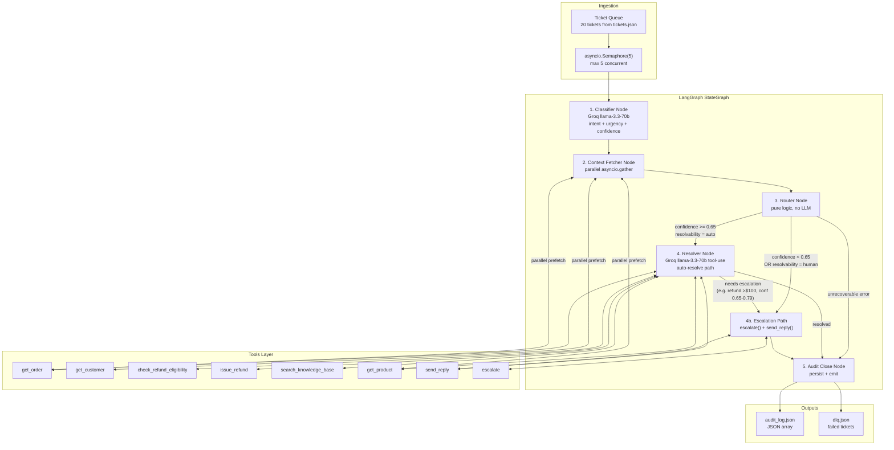
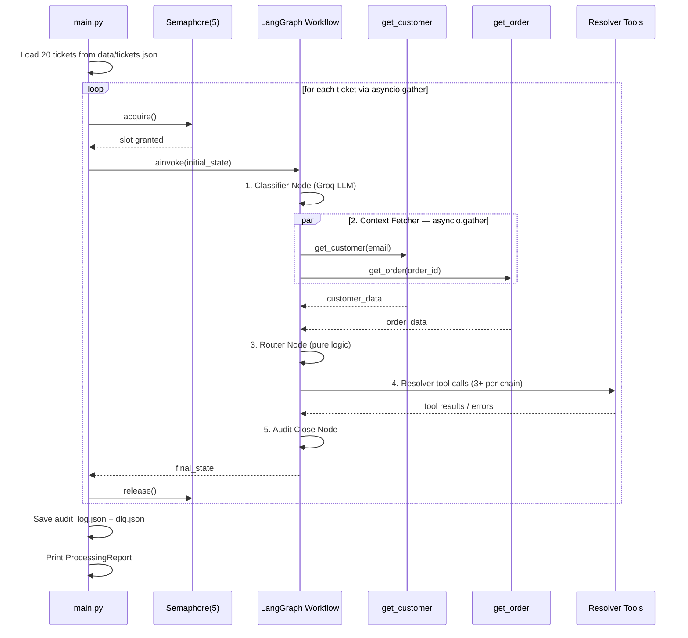
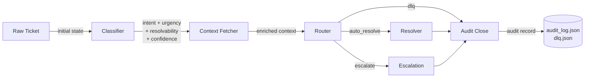
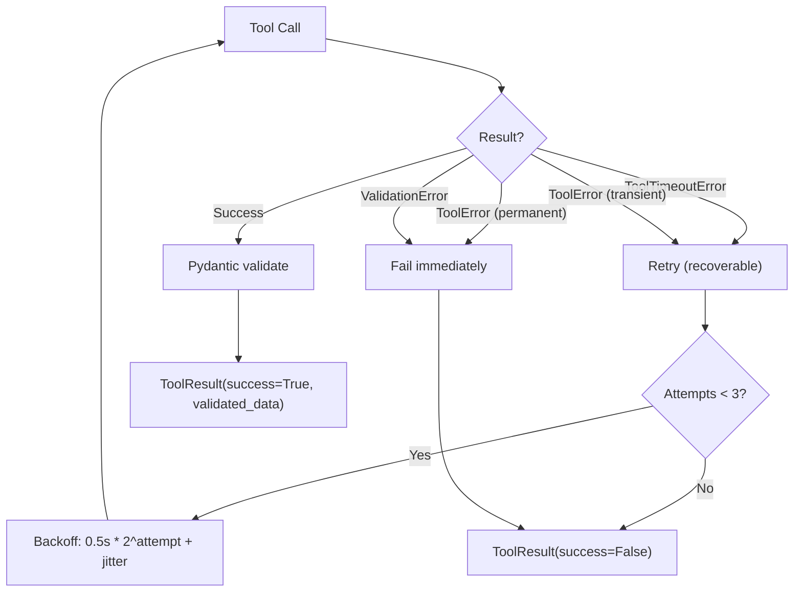
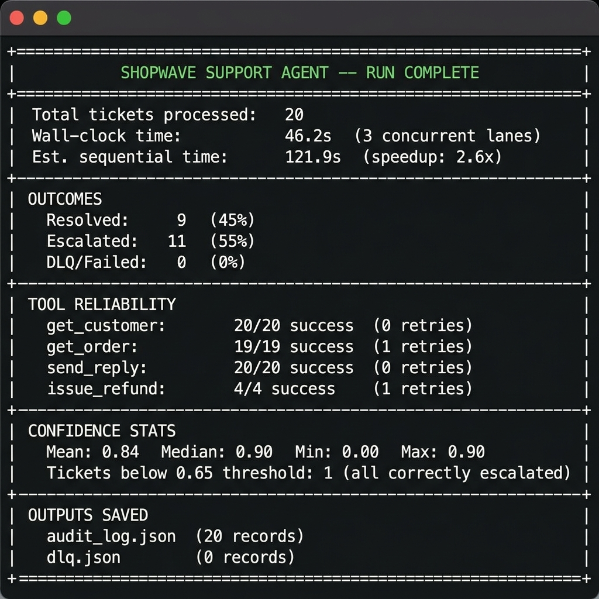
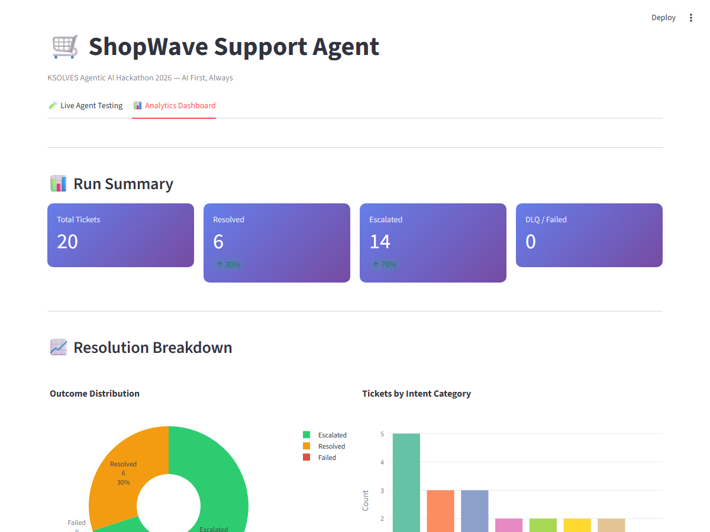
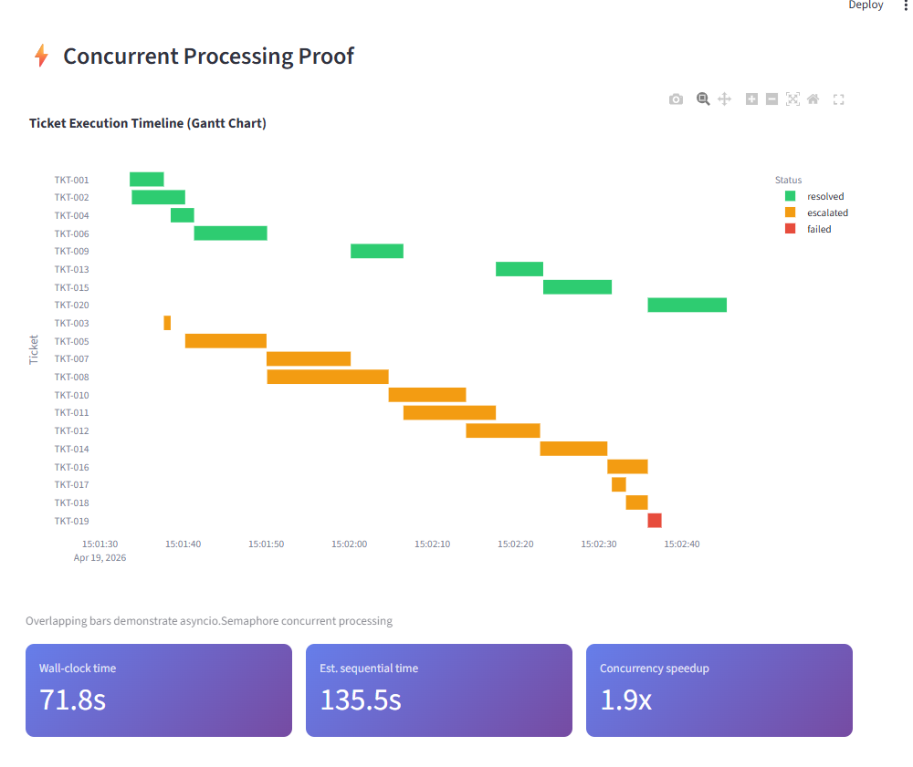
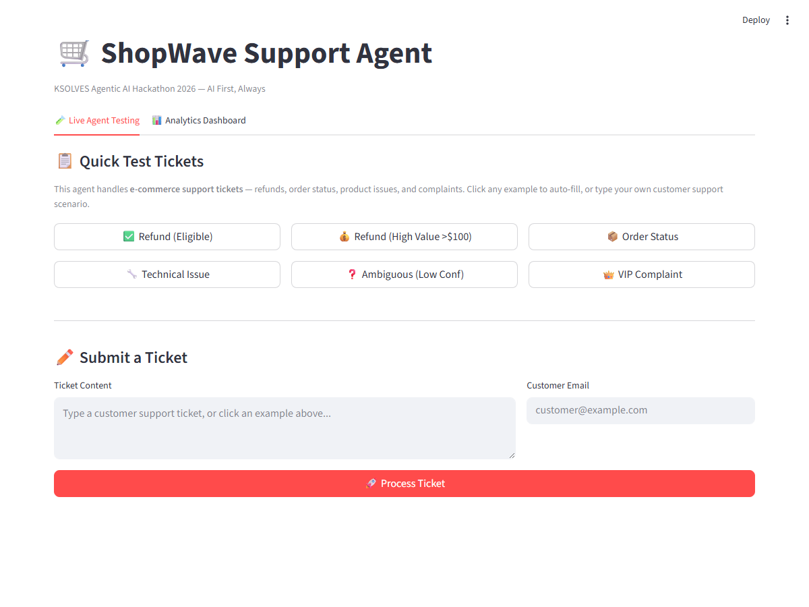

# ShopWave Support Agent

> **KSOLVES Agentic AI Hackathon 2026** — "AI First, Always"

An autonomous AI customer support agent built with **LangGraph** and **Groq (Llama 3.3 70B)**. Processes 20 e-commerce support tickets end-to-end — classifying intent, fetching context, resolving with tools, and escalating intelligently — all with full audit trails, fault tolerance, and graceful failure handling.

> **Quick demo:** `cp .env.example .env && pip install -r requirements.txt && python -m src.main && streamlit run streamlit_app.py`

## Architecture

### High-Level System Diagram



### Concurrency Model



### Data Flow



## Quick Start

```bash
# Clone the repository
git clone https://github.com/saikiranpulagalla/hackathon2026-saikiranpulagalla.git
cd shopwave-support-agent

# Set up environment
cp .env.example .env
# Edit .env and add your GROQ_API_KEY (get one free at https://console.groq.com/keys)

# Install dependencies
pip install -r requirements.txt

# Run all 20 tickets
python -m src.main
```

## Docker

```bash
cp .env.example .env
# Add your GROQ_API_KEY to .env

docker-compose up
```

## Project Structure

```
shopwave-support-agent/
├── src/
│   ├── main.py                  # Entry point — process_all_tickets()
│   ├── __main__.py              # Module runner (python -m src.main)
│   ├── agent/
│   │   ├── state.py             # AgentState TypedDict + data models
│   │   ├── graph.py             # LangGraph workflow + route_edge()
│   │   ├── nodes.py             # All 5 node functions
│   │   └── router.py            # determine_routing() + CONFIDENCE_THRESHOLD
│   ├── tools/
│   │   ├── mock_tools.py        # 8 async mock tools with realistic failures
│   │   ├── schemas.py           # Pydantic v2 response schemas (8 schemas)
│   │   ├── retry.py             # retry_with_backoff() — exponential backoff
│   │   └── exceptions.py        # ToolTimeoutError, ToolError, ToolBaseError
│   ├── evaluation/
│   │   ├── confidence.py        # Confidence threshold logic
│   │   └── metrics.py           # ProcessingReport — rich terminal output
│   └── infrastructure/
│       ├── audit.py             # AuditLogger — thread-safe JSON array output
│       └── dlq.py               # DeadLetterQueue — thread-safe DLQ
├── data/
│   └── tickets.json             # 20 sample tickets (all categories + edge cases)
├── tests/
│   ├── unit/                    # 19 unit tests (retry, router, tools, schemas)
│   ├── property/                # Property-based tests (hypothesis)
│   └── integration/             # End-to-end workflow tests
├── screenshots/                 # Dashboard and terminal screenshots for demo
├── streamlit_app.py             # Unified interface — Live Testing + Analytics Dashboard
├── live_tab.py                  # Live Agent Testing tab (interactive, calls real agent)
├── smoke_test.py                # Infrastructure smoke test (no API key needed)
├── architecture.png             # 1-page architecture diagram (standalone)
├── failure_modes.md             # 7 failure scenarios with system responses
├── Dockerfile                   # Python 3.11-slim container
├── docker-compose.yml           # Local dev orchestration
├── requirements.txt             # All dependencies
├── .env.example                 # GROQ_API_KEY + LangSmith tracing vars
└── .gitignore                   # Excludes .env, __pycache__, outputs
```

## Architecture Decisions

| Decision | Rationale |
|---|---|
| **LangGraph StateGraph** | Explicit state machine with typed state. Every transition is deterministic and inspectable. State fields use `Annotated[list, operator.add]` reducers — `tool_calls`, `errors`, and `node_history` are append-only by design, never overwritten. This gives a built-in, tamper-evident audit trail. |
| **asyncio.Semaphore(5)** | Caps concurrent LLM calls to prevent rate limiting while achieving meaningful parallelism. Within each ticket, context fetcher runs `get_customer` + `get_order` simultaneously via `asyncio.gather`. |
| **Pydantic v2 schema validation** | Every tool output is validated at the boundary. Malformed responses are *returned* as bad dicts (not raised), matching real HTTP 200 with garbage body behavior. `ValidationError` is non-recoverable — no wasted retries on deterministic failures. |
| **Confidence gate at 0.65** | Better to escalate than act on uncertain information, especially for irreversible actions like refunds. Threshold is configurable in `src/agent/router.py`. |
| **Secondary gate at 0.80 for refunds >$100** | High-value refunds with moderate confidence (0.65–0.79) are escalated. The cost of a wrong refund exceeds the cost of human review. |
| **"When NOT to act" principle** | The agent has three explicit stop conditions: (1) confidence < 0.65 → escalate instead of attempting resolution, (2) refund amount > $100 with confidence 0.65–0.79 → escalate (wrong refund cost > human review cost), (3) `issue_refund` is NEVER called unless `check_refund_eligibility` explicitly returns `eligible: true` in the same reasoning chain. The agent does nothing rather than act on uncertainty for irreversible actions. |
| **Dead Letter Queue** | Tickets that fail completely are preserved with full partial state. Nothing is silently dropped. Operators can review `dlq.json` and process manually. |
| **Groq (Llama 3.3 70B)** | Fast inference with tool-use support via OpenAI-compatible API. Free tier sufficient for hackathon. Same model for both classification and resolution. |

## Key Features

- **Concurrent batch processing** — 20 tickets via `asyncio.gather` with `Semaphore(5)`
- **Parallel context fetching** — `get_customer` + `get_order` run simultaneously per ticket
- **Retry with exponential backoff** — 3 retries, 0.5s base delay, jitter for all tool calls
- **Schema validation** — Pydantic v2 on every tool output, 8 strict schemas
- **Confidence-gated actions** — primary threshold at 0.65, secondary at 0.80 for high-value refunds
- **Idempotency guard** — checks `state.refund_result` to prevent double-refunds
- **Structured escalation** — JSON summary with context, classification, tools tried
- **Full audit trail** — `audit_log.json` with reasoning, confidence, tool call chain, timing
- **Dead Letter Queue** — `dlq.json` for unrecoverable failures with full partial state
- **7 documented failure modes** — see `failure_modes.md`
- **19 passing unit tests** — retry logic, routing, tools, schema validation

### Mandatory 3+ Tool Call Chain (per hackathon requirement)

For **refund tickets** (eligible):
1. `get_customer(email)` — verify customer tier and history
2. `check_refund_eligibility(order_id)` — confirm eligibility before acting
3. `issue_refund(order_id, amount)` — execute (only after steps 1+2 confirm)
4. `send_reply(ticket_id, message)` — confirm outcome to customer

For **ineligible refund tickets**:
1. `get_customer(email)` — fetch customer context
2. `search_knowledge_base("refund policy")` — retrieve relevant policy
3. `send_reply(ticket_id, message)` — explain policy with empathy

For **order status tickets**:
1. `get_customer(email)` — verify customer
2. `get_order(order_id)` — fetch tracking + status
3. `send_reply(ticket_id, message)` — share tracking info

The 3-call minimum is enforced by the resolver prompt — it never calls `send_reply` without first completing context + action verification steps.

## Tool Signatures

| Tool | Parameters | Returns | Failure Rate |
|---|---|---|---|
| `get_order` | `order_id: str` | `OrderData` (status, items, total, tracking) | 10% timeout, 5% malformed, 5% error |
| `get_customer` | `email: str` | `CustomerData` (tier, total_orders) | 5% timeout, 3% malformed, 2% error |
| `get_product` | `product_id: str` | `ProductData` (price, in_stock, category) | 5% timeout, 5% malformed, 3% error |
| `check_refund_eligibility` | `order_id: str` | `RefundEligibilityData` (eligible, max_amount) | 15% timeout, 8% malformed, 7% error |
| `issue_refund` | `order_id: str, amount: float` | `RefundResult` (refund_id, status) | 10% timeout, 5% malformed, 10% error |
| `search_knowledge_base` | `query: str` | `list[KnowledgeResult]` (articles) | 8% timeout, 10% malformed, 5% error |
| `send_reply` | `ticket_id: str, message: str` | `SendReplyResult` (delivered, channel) | 5% timeout, 2% malformed, 3% error |
| `escalate` | `ticket_id: str, summary: str, priority: str` | `EscalationResult` (team, ETA) | 3% timeout, 2% malformed, 2% error |

## Error Handling Strategy



## Sample audit_log.json Entry

Every ticket produces a complete audit record with reasoning, confidence scores, and full tool call chain:

```json
{
  "ticket_id": "TKT-007",
  "customer_id": "CUST-007",
  "customer_email": "grace@example.com",
  "order_id": "ORD-4456",
  "intent": "refund_request",
  "urgency": "medium",
  "resolvability": "auto",
  "confidence": 0.87,
  "classification_reasoning": "Explicit refund request with order ID mentioned and clear cancellation context",
  "routing_decision": "auto_resolve",
  "resolution_status": "resolved",
  "reply_text": "Hi Grace, I've processed your refund of $89.99 for order ORD-4456. You should see it in your account within 5-7 business days.",
  "escalation_reason": null,
  "node_history": ["classifier", "context_fetcher", "router", "resolver", "audit_close"],
  "tool_calls": [
    {"tool_name": "get_customer", "attempt": 1, "success": true, "duration_ms": 78, "validated": true},
    {"tool_name": "get_order", "attempt": 1, "success": true, "duration_ms": 152, "validated": true},
    {"tool_name": "check_refund_eligibility", "attempt": 1, "success": false, "error_type": "timeout", "duration_ms": 501},
    {"tool_name": "check_refund_eligibility", "attempt": 2, "success": true, "duration_ms": 312, "validated": true},
    {"tool_name": "issue_refund", "attempt": 1, "success": true, "duration_ms": 634, "validated": true},
    {"tool_name": "send_reply", "attempt": 1, "success": true, "duration_ms": 98, "validated": true}
  ],
  "errors": [
    {"node": "context_fetcher", "tool_name": "check_refund_eligibility", "error_type": "timeout", "message": "check_refund_eligibility timed out", "recoverable": true}
  ],
  "total_duration_ms": 2847,
  "started_at": "2026-04-17T10:23:11.000Z",
  "completed_at": "2026-04-17T10:23:14.847Z"
}
```

This shows: classification reasoning, confidence score, the timeout that was retried successfully, the full 6-tool call chain, and the customer-facing reply — all in one auditable record.

## Judging Criteria Alignment

| Criterion | Points | Implementation |
|---|---|---|
| **Production Readiness** | 30 | Modular `src/` structure, Pydantic v2 validation on every tool output, retry with exponential backoff, no hardcoded secrets (`.env`), Docker + docker-compose, structured error handling |
| **Engineering Depth** | 30 | `asyncio.Semaphore(5)` batch + `asyncio.gather` within-ticket parallelism, 8 mock tools with configurable failure rates, LangGraph `TypedDict` state with `Annotated` reducers, 19 unit tests + hypothesis property tests |
| **Presentation** | 20 | 4 Mermaid architecture diagrams, comprehensive README, sample audit log, tool signature table, failure modes doc, demo-ready |
| **Agentic Design** | 10 | Confidence gates (0.65 primary + 0.80 secondary for high-value refunds), explicit "when NOT to act" principle, structured escalation with context, idempotency guard on irreversible actions |
| **Evaluation** | 10 | Confidence scoring at classify → route → resolve stages, `ProcessingReport` with resolution/escalation/failure metrics, DLQ for feedback loop analysis |

## What I'd Add With More Time

- **Redis-backed DLQ** — persistence across restarts, retry scheduling
- **Webhook ingestion** — real-time ticket processing instead of batch
- **Vector database** — semantic search for knowledge base (currently mock)
- **Fine-tuned classifier** — domain-specific model for higher confidence scores
- **A/B testing framework** — compare escalation thresholds and resolution strategies
- **Circuit breaker** — stop retrying a tool after N consecutive failures across all tickets
- **Structured logging** — `structlog` for JSON log output to observability platforms
- **Metrics dashboard** — Grafana/Prometheus for real-time throughput and error rate monitoring

## Running Tests

```bash
# Unit tests (19 tests)
pytest tests/unit/ -v

# Property-based tests
pytest tests/property/ -v

# All tests with coverage
pytest --cov=src tests/

# Smoke test (no API key needed)
python smoke_test.py
```

## LangSmith Tracing

Every ticket execution is traced end-to-end in LangSmith, showing:
- Each LangGraph node execution (Classifier → Context Fetcher → Router → Resolver → Audit Close)
- Every tool call with input/output and latency
- Token usage per LLM call
- The complete reasoning chain for each routing decision

To enable tracing:
1. Get a free API key at https://smith.langchain.com
2. Add `LANGSMITH_API_KEY=your_key` to your `.env`
3. Set `LANGCHAIN_TRACING_V2=true` in your `.env`
4. Run `python -m src.main` — traces appear at https://smith.langchain.com

Without a LangSmith key, the agent runs normally with no tracing overhead.
Tracing is completely optional and gracefully disabled if the key is not set.

## Interactive Demo & Analytics

The agent comes with a unified Streamlit interface for live testing and analytics:

```bash
# Step 1: Start the interface
streamlit run streamlit_app.py

# Step 2: Open http://localhost:8501
# Tab 1: "🧪 Live Agent Testing" — submit tickets and watch the agent reason
# Tab 2: "📊 Analytics Dashboard" — view results after running all 20 tickets
```

### Live Agent Testing Tab

Submit any customer support ticket and watch the agent process it in real-time:

- **6 pre-built example tickets** — covering every agent behavior (auto-resolve, escalate via primary gate, escalate via secondary $100 gate, DLQ scenario)
- **Confidence meter** — visual bar showing your ticket's confidence vs the 0.65 and 0.80 thresholds
- **Live execution trace** — see each node (Classifier → Context Fetcher → Router → Resolver) complete in sequence
- **Tool call chain** — every tool called, attempt number, success/failure, latency in milliseconds
- **Parallel execution indicator** — shows when `get_customer` and `get_order` ran simultaneously
- **Customer reply** — the exact message that would be sent to the customer
- **Downloadable audit entry** — every test run produces a downloadable JSON audit record

### Analytics Dashboard Tab

Post-run analytics after processing all 20 tickets (requires `python -m src.main` first):
- **Run summary**: resolved/escalated/failed counts with percentages
- **Confidence distribution**: histogram with escalation thresholds marked
- **Tool performance table**: success rate, avg latency, timeout count per tool
- **Concurrent processing proof**: Gantt chart showing overlapping ticket execution
- **Audit log explorer**: click any ticket to inspect its full reasoning chain and tool call timeline
- **DLQ viewer**: inspect failed tickets with full partial state

## Screenshots

### Terminal Output — ProcessingReport


### Streamlit Dashboard — Run Summary


### Streamlit Dashboard — Concurrent Processing Proof


### Streamlit Live Agent Testing


### Run Order for Demo

```bash
# Step 1: Run the agent (generates audit_log.json and dlq.json)
python -m src.main

# Step 2: Open the monitoring dashboard
streamlit run streamlit_app.py

# Step 3: Verify infrastructure without API key
python smoke_test.py

# Step 4: Run all tests
pytest tests/ -v --tb=short
```

## Verifying It Works (No API Key Needed)

```bash
# Test all infrastructure without any API key
python smoke_test.py
# Expected: 6/6 PASS

# Run the test suite
pytest tests/unit/ -v
# Expected: 19/19 PASS

# Launch the dashboard (Analytics tab shows placeholder without audit_log.json)
streamlit run streamlit_app.py
```

## Demo Video

[Watch the 5-minute demo](https://[link-to-video])

**Demo walkthrough:**
- 0:00 — Project structure and architecture overview
- 0:45 — `python -m src.main` processing all 20 tickets live (concurrency visible in terminal)
- 2:00 — Terminal ProcessingReport output (resolved/escalated/DLQ counts + speedup)
- 2:30 — Streamlit Live Testing Tab: submit refund ticket → watch agent reason step by step
- 3:30 — Clicking "💰 Refund (High Value)" → secondary 0.80 gate triggers → escalation
- 4:15 — Analytics Dashboard: Gantt chart proving concurrent execution
- 4:45 — audit_log.json walkthrough: confidence, tool call chain, retry recovery

## License

Built for the KSOLVES Agentic AI Hackathon 2026.
